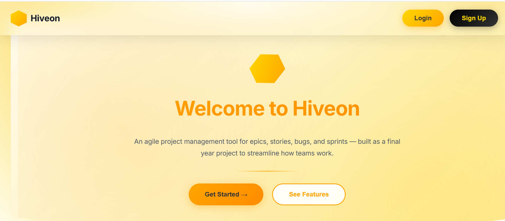
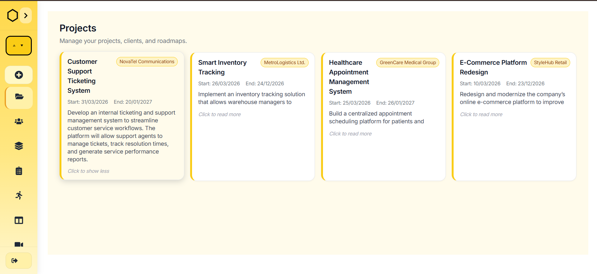
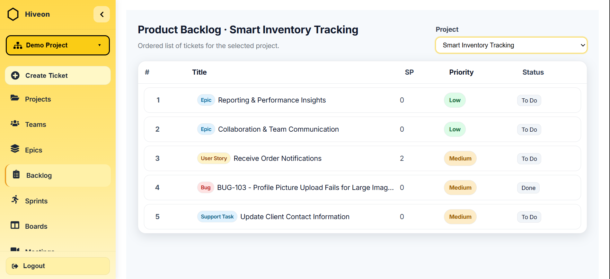
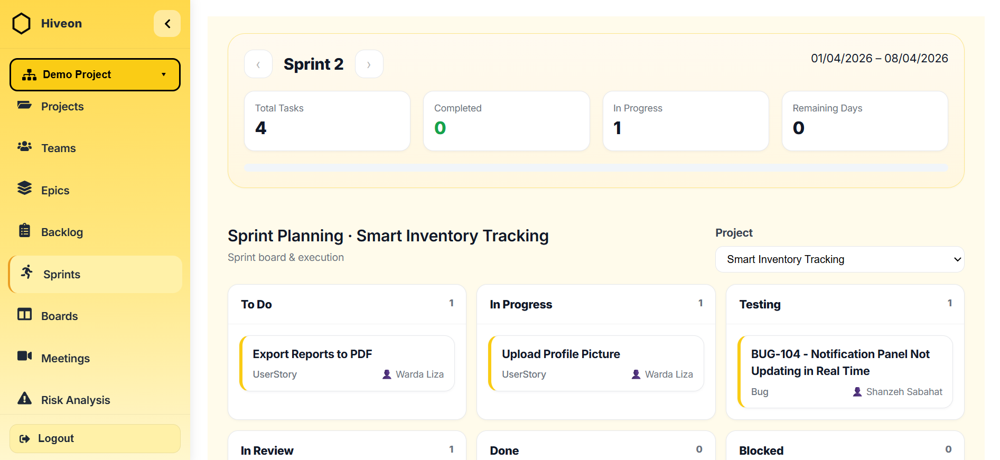
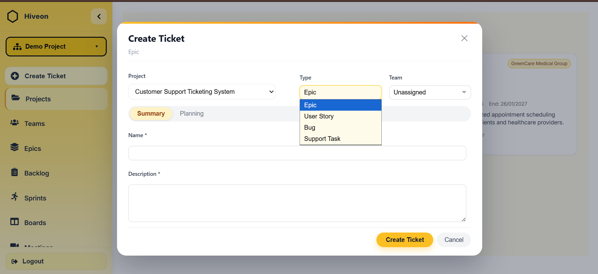
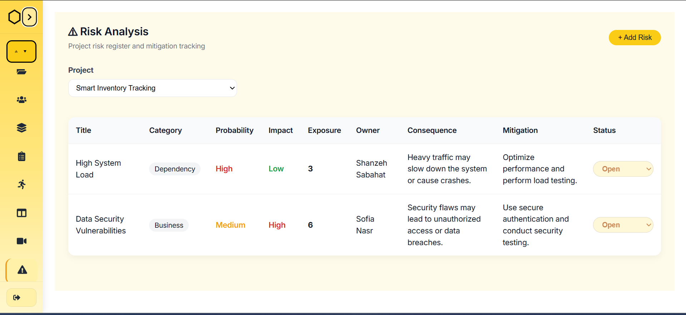
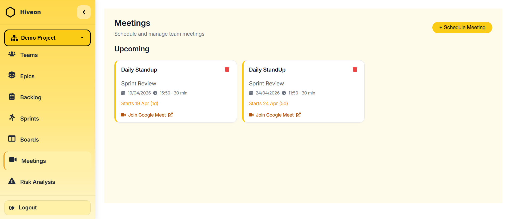

# Hiveon — Agile Project Management System

Hiveon is a full-stack Agile project management platform designed to simulate real-world software development workflows used by engineering teams.

It focuses on structured sprint execution, backlog management, team collaboration, and role-based access control.

The system is built to replicate production-level Agile processes in a simplified and scalable way.

---

## Key Features

### Authentication & Authorization
- Secure login system using JWT authentication
- Google OAuth integration
- Role-based access control (Product Owner, Scrum Master, Developer)
- Protected routes and session management

---

### Project & Workspace Management
- Create and manage multiple projects
- Workspace-based isolation for teams
- Role assignment during project setup
- Structured project metadata management

---

### Agile Ticket System
- Unified system for Epics, Stories, Bugs, and Support Tasks
- Dynamic validation based on ticket type
- Full lifecycle tracking for all work items

---

### Sprint & Backlog Management
- Sprint creation with timeline validation
- Backlog grooming and prioritization
- Story point enforcement before sprint assignment
- Sprint readiness rules for structured planning

---

### Kanban Board
- Drag-and-drop task movement
- Real-time status updates
- Role-based restrictions for critical actions
- Full activity logging for traceability

---

### Bug & Risk Management
- Bug tracking with severity, probability, and environment classification
- Automatic P1 tagging for production-critical issues
- Risk scoring system using Probability × Impact
- Risk status tracking (Open, Mitigated, Closed)

---

### Team Management
- Create teams with assigned team leads
- Multi-team membership support
- Separate boards per team
- Structured collaboration hierarchy

---

### Collaboration System
- Ticket-based commenting system
- @mention notifications
- Activity logs with timestamps
- Email notifications for key actions

---

### Dashboard & Analytics
- Sprint progress tracking
- Velocity metrics
- Ticket distribution overview
- Real-time data updates

---

### Meeting Integration
- Google Meet scheduling from within the platform
- Automated meeting link generation
- Team-wide notifications for meetings

---

## Tech Stack

Frontend: React, Tailwind CSS  
Backend: ASP.NET Core Web API  
Database: SQL Server  
Authentication: JWT, Google OAuth  

## Screenshots

### Home / Dashboard

### Projects

### Backlog

### Sprints

### Ticket Creation

### Risk Analysis

### Meetings

---

## Setup Instructions

This project is provided for demonstration purposes.

### Backend
- Open solution in Visual Studio
- Configure database in `appsettings.json`
- Run the server

### Frontend
- Navigate to frontend folder
- Run:
  npm install  
  npm run dev
  
## Project Focus

This project was designed to demonstrate:
- Full-stack system architecture
- Agile workflow implementation
- Role-based access control design
- Real-time state management
- Scalable backend API structure
